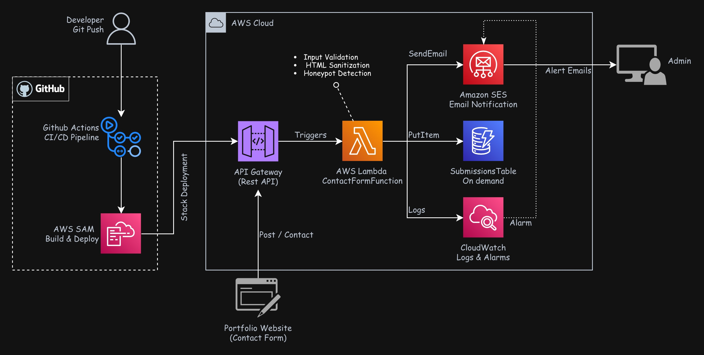

# Serverless Contact Form API

[](https://github.com/Kevinnra/Serverless-Contact-Form-API/actions/workflows/deploy-serverless-api.yaml)
[](https://aws.amazon.com)


[](https://python.org)
[](LICENSE)

> A production-ready serverless REST API that processes contact form submissions from [kevinnramirez.com](https://kevinnramirez.com) — built with AWS Lambda, API Gateway, DynamoDB, and SES, deployed automatically via GitHub Actions and AWS SAM.

**🔗 Live:** Contact form at [kevinnramirez.com/contact](https://www.kevinnramirez.com/#contact)

---


#### Problem Statement
Static portfolio websites need a way to receive visitor messages without a traditional backend server. Running a dedicated server 24/7 for a contact form is wasteful, expensive, and over-engineered for the use case.

#### Solution
A fully serverless API built on AWS that costs effectively **$0/month** (within free tier), scales automatically to any traffic level, and deploys itself on every Git push — no servers to manage, no runtime to maintain.

#### Key Results
- **$0.00/month** operational cost within AWS Free Tier
- **< 300ms** average API response time
- **100% automated** deployments via GitHub Actions + AWS SAM
- **Zero infrastructure management** — fully serverless architecture
- **Security hardened** — input sanitization, rate limiting, honeypot spam detection

---

### 🏗️ Architecture



---


### AWS Infrastructure
| Service | Role |
|---|---|
| **AWS Lambda** | Serverless compute — runs Python handler on each request |
| **API Gateway** | REST API endpoint with rate limiting (5 req/s, burst 10) |
| **DynamoDB** | NoSQL storage for all form submissions |
| **Amazon SES** | Sends email notifications on each submission |
| **CloudWatch** | Logs, metrics, and error alarms |
| **Amazon SNS** | Alert notifications for ops events |
| **AWS SAM** | Infrastructure as Code — defines all resources in template |
| **CloudFormation** | SAM compiles to CloudFormation for deployment |
| **IAM** | Least-privilege execution role for Lambda |

### DevOps & Automation
| Tool | Role |
|---|---|
| **GitHub Actions** | CI/CD — auto-deploys on push to `main` |
| **AWS SAM CLI** | Build, test, and deploy serverless apps |
| **Python 3.13** | Lambda function runtime |
| **pytest** | Unit and integration testing |

---

##  Key Features

### 1. Automated CI/CD with AWS SAM
Every push to `main` triggers GitHub Actions, which runs `sam build` and `sam deploy`, automatically updating the Lambda function and all infrastructure through CloudFormation. Zero manual steps after initial setup.

### 2. Data Validation & Security
- **Input validation** — required fields, length limits, email format checks
- **HTML sanitization** — strips `<script>` tags and escapes special characters before storage
- **Honeypot field** — silent bot detection; bots that fill the hidden field get a fake 200 response while nothing is stored or emailed
- **Rate limiting** — API Gateway throttles to 5 requests/second (burst of 10) to prevent abuse

### 3. Monitoring & Observability
- CloudWatch collects all Lambda logs automatically
- Custom CloudWatch alarms trigger SNS alerts on error spikes
- Real-time log tailing via `sam logs`

### 4. Cost Optimization
- Serverless architecture means zero cost when idle
- DynamoDB on-demand pricing — pay only per request
- SES pricing is a fraction of a cent per email
- CloudWatch free tier covers typical portfolio traffic

---

### 🪂 Deployment

```bash
git clone https://github.com/Kevinnra/Serverless-Contact-Form-API.git
cd Serverless-Contact-Form-API/serverless-api
sam build
sam deploy --guided
```

Set `AWS_ACCESS_KEY_ID`, `AWS_SECRET_ACCESS_KEY`, and `AWS_REGION` as GitHub Secrets — after that, every push to `main` deploys automatically.

See **[docs/DEPLOYMENT.md](docs/DEPLOYMENT.md)** for the full step-by-step guide.

---

### 🧪 Testing

#### Unit Tests
```bash
cd serverless-api
pip install pytest
PYTHONPATH=. pytest tests/test_lambda.py -v
```

#### Live API Tests
```bash
curl -X POST YOUR-API-ENDPOINT \
  -H "Content-Type: application/json" \
  -d '{"name":"Test User","email":"test@example.com","message":"Hello!"}'
```

See **[docs/DEPLOYMENT.md](docs/DEPLOYMENT.md#testing)** for honeypot, XSS, rate limiting, and log commands.

---

### 📁 Project Structure

```
.
├── .github/
│   └── workflows/
│       └── deploy-serverless-api.yaml    # CI/CD pipeline (auto-deploy on push)
├── docs/
│   └── DEPLOYMENT.md                     # Detailed deployment instructions
├── serverless-api/                       # Lambda function & infrastructure
│   ├── template.yaml                     # SAM CloudFormation template
│   ├── samconfig.toml                    # SAM deploy configuration
│   ├── requirements.txt                  # Python dependencies
│   ├── conftest.py                       # required for pytest to discover tests
│   ├── src/
│   │   ├── __init__.py
│   │   └── lambda_function.py            # Contact form handler
│   ├── tests/
│   │   ├── __init__.py
│   │   └── test_lambda.py                # Unit tests
│   └── events/
│       └── test-event.json               # Sample Lambda event for local testing
├── .gitignore
├── config.json.example                   # Config template (actual config.json is gitignored)
├── serverless-deploy-policy.json         # Least-privilege IAM policy for SAM deployer
└── README.md
```

> **Note:** `.aws-sam/` (SAM build output) and `config.json` (contains API endpoint URL) are gitignored and not committed to the repository.

### Directory Descriptions

| Directory | Purpose |
|---|---|
| `.github/workflows/` | GitHub Actions CI/CD automation |
| `docs/` | Documentation (deployment guide, architecture notes, etc.) |
| `serverless-api/` | Lambda function code, tests, and SAM infrastructure |
| `serverless-api/src/` | Lambda function source code |
| `serverless-api/tests/` | Unit and integration tests |
| `serverless-api/events/` | Sample Lambda events for local testing |

---

### Challenges & Solutions

#### Challenge 1: Understanding the Infrastructure Before Automating It
**Problem:** Jumping straight into SAM without understanding how the individual AWS services actually connect — what triggers what, how IAM roles are scoped, how API Gateway routes map to Lambda functions.

**Solution:** Built the entire stack manually through the AWS Console first — creating the Lambda function, API Gateway, DynamoDB table, SES configuration, and IAM role step by step. Once everything was wired together and working, the insight became clear: every click in the console is just a configuration value. SAM's `template.yaml` is those same decisions written as code — `AWS::Serverless::Function` replaces the Lambda console form, `Events: Api:` replaces the API Gateway trigger wizard, `Policies:` replaces the IAM role builder. Understanding the manual process made the IaC layer intuitive rather than abstract.

#### Challenge 2: SES Sandbox Restrictions
**Problem:** By default, AWS SES operates in sandbox mode where you can only send to verified email addresses, making real-world testing difficult.

**Solution:** Verified both sender and recipient email addresses in SES, and documented the production SES request process in setup docs. The architecture supports moving to production SES with a simple configuration change.

#### Challenge 3: Debugging CloudFormation Stack Failures
**Problem:** When a `sam deploy` fails mid-way, CloudFormation rolls back the entire stack — but the error message in the CLI is often vague, making it hard to pinpoint the root cause.

**Solution:** Learned to go directly to the AWS Console → CloudFormation → Stack events tab, which shows the exact resource that failed and the detailed error reason. Combined with `sam logs` for Lambda-level errors and CloudWatch for runtime issues, this three-layer debugging approach (CloudFormation events → SAM logs → CloudWatch) resolved every deployment failure encountered during the project.

---

### 💰 Cost Analysis

| Service | Configuration | Monthly Cost |
|---|---|---|
| Lambda | ~500 invocations/month | $0.00 (Free Tier: 1M/month) |
| API Gateway | ~500 requests/month | $0.00 (Free Tier: 1M/month) |
| DynamoDB | On-demand, ~500 writes | $0.00 (Free Tier: 25 WCU) |
| SES | ~500 emails/month | $0.00 (Free Tier: 3,000/month) |
| CloudWatch | Standard logs | $0.00 (Free Tier: 5GB) |
| **Total** | | **$0.00/month** |

---

### Future Improvements

- [ ] Add WAF rules to API Gateway for advanced threat protection
- [ ] Migrate infrastructure to Terraform for multi-environment support


---

### 📚 What I Learned

- **Serverless architecture patterns** — event-driven design, stateless functions, managed services
- **AWS SAM & CloudFormation** — Infrastructure as Code for serverless resources
- **API Gateway configuration** — REST APIs, throttling, CORS, stage variables
- **DynamoDB data modeling** — NoSQL design, on-demand capacity, item structure
- **IAM least-privilege** — scoping Lambda execution roles to minimum required permissions
- **CI/CD with GitHub Actions** — automated SAM deployments triggered on push
- **Security fundamentals** — input validation, sanitization, rate limiting, bot detection

---

### 📞 Contact

**Kevin Ramirez**
- Portfolio: [www.kevinnramirez.com](https://www.kevinnramirez.com)
- GitHub: [@Kevinnra](https://github.com/Kevinnra)
- LinkedIn: [linkedin.com/in/kevinnramirez](https://www.linkedin.com/in/kevinnramirez/)

---

*Built with ☁️ by [Kevinn Ramirez](https://kevinnramirez.com) | Deployed on AWS*